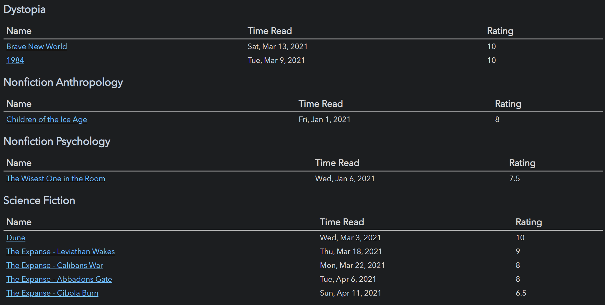

# 코드 블록 예제

## 그룹화된 책

장르별로 책을 그룹화하고, 각각의 등급에 따라 정렬된 테이블을 생성하는 간단한 dataview 렌더링 API 사용 예시입니다:

```js
for (let group of dv.pages("#book").groupBy(p => p.genre)) {
	dv.header(3, group.key);
	dv.table(["Name", "Time Read", "Rating"],
		group.rows
			.sort(k => k.rating, 'desc')
			.map(k => [k.file.link, k["time-read"], k.rating]))
}
```



## 직접 및 간접적으로 연결된 모든 페이지 찾기

현재 노트나 선택한 노트에 연결된 모든 노트를 찾기 위해 간단한 집합(set) + 스택(depth first search)을 사용합니다:

```js
let page = dv.current().file.path;
let pages = new Set();

let stack = [page];
while (stack.length > 0) {
	let elem = stack.pop();
	let meta = dv.page(elem);
	if (!meta) continue;

	for (let inlink of meta.file.inlinks.concat(meta.file.outlinks).array()) {
		console.log(inlink);
		if (pages.has(inlink.path)) continue;
		pages.add(inlink.path);
		stack.push(inlink.path);
	}
}

// 데이터는 현재 페이지와 직접 또는 간접적으로 연결된 모든 페이지의 파일 메타데이터입니다.
let data = dv.array(Array.from(pages)).map(p => dv.page(p));
```