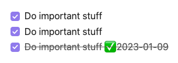

# 사용자 정의 상태 스타일링

<span class="related-pages">#css</span>

## 요약

Tasks에서 [[Custom Statuses-ko|사용자 정의 상태]]를 사용하려면 다음 중 하나를 설치하고 활성화해야 작업이 잘 보이도록 할 수 있습니다:

- 사용자 정의 CSS Snippet
- 테마

테마 대신 스니펫을 선택하는 것이 좋습니다.

왜냐하면 테마에서 사용자 지정 체크박스를 선택한 경우 해당 테마에 영구적으로 종속되기 때문입니다.

하지만 대부분의 스니펫은 어떤 테마에든 적용할 수 있으므로 더 많은 유연성을 제공합니다.

다른 CSS Snippet과 Theme은 `[[Set up custom statuses-ko|사용자 정의 상태 설정]]` 및 `]` 안에 다른 문자와 기호를 사용하기 때문에, 먼저 스타일을 선택한 후 선택한 스타일이 지원하는 기호 문자에 맞게 [사용자 정의 상태 설정]을 해주는 것이 더 효율적입니다.

이 페이지에서는 CSS snippet을 다운로드하고 사용하여 작업을 잘 보이도록 하는 방법에 대해 안내합니다.

## 가정

Obsidian에서 [CSS snippets](https://help.obsidian.md/How+to/Add+custom+styles#Use+Themes+and+or+CSS+snippets)를 사용하는 방법을 알고 있다고 가정합니다.

## 기본 모양

다음과 같은 세 가지 커스텀 상태가 있는 작업들이 있다고 가정해봅시다:

```text
- [!] #task 중요한 일 처리하기
- [D] #task 중요한 일 처리하기
- [X] #task 중요한 일 처리하기 ✅ 2023-01-09
```

Tasks는 어떠한 커스텀 상태도 의미하지 않습니다. 이는 기본적으로 이러한 작업들은 다음과 같이 표시됩니다:



- 첫 번째와 두 번째 작업은 '완료되지 않았어야 할' 작업인데, 체크 마크가 있습니다.
- 세 개의 작업 모두 완료된 것처럼 보입니다. 왜냐하면 `[]` 안에 공백이 없기 때문입니다.
- `[X]`가 포함된 하나만 줄 그어져 있습니다. Tasks는 `[x]` 또는 `[X]`가 포함된 줄만 완료로 간주합니다.

## 커스텀 스타일 선택: SlrVb's Alternate Checkboxes

Obsidian에서 체크박스 모양을 변경할 수 있는 많은 커뮤니티 Snippet과 Theme가 있으며, 사람마다 선호도가 다릅니다.

Tasks에서는 (그리고 필요로 합니다) 자체적인 스타일 옵션을 선택할 수 있게 해줍니다. [[About Status Collections-ko|상태 컬렉션 정보]] 에서 일반적인 몇 가지 예제를 확인할 수 있습니다.

예제를 위해 [[Custom Statuses-ko|SlRvb's Alternate Checkboxes]]로 우리의 작업들에 스타일을 입혔다고 가정합시다.


## SlrVb's Alternate Checkboxes 설치하기

[Snippet 다운로드](https://github.com/SlRvb/Obsidian--ITS-Theme/blob/main/Guide/Alternate-Checkboxes.md), 본인 Vault 폴더 내 snippet 폴더 안에 추가하고, 해당 snippet 활성화하세요.

위 세 개 task line은 이제 아래와 같이 나타납니다:


## 사용자 정의 스타일링 커스터마이징: Style Settings 플러그인

[Style Settings](https://github.com/mgmeyers/obsidian-style-settings) 플러그인을 설치하고 SlrVb's Alternate Checkboxes의 모양을 사용자 정의할 수도 있습니다.

- [Style Settings 플러그인을 본인 Vault에 설치하기 위한 링크](obsidian://show-plugin?id=obsidian-style-settings)를 사용하세요.
- 플러그인을 활성화하세요.

이제 Style Settings 플러그인의 옵션으로 이동할 수 있습니다:


'SlRvb's Checkboxes' 섹션을 확장하고 다음 옵션들을 켜세요:


이제 위 세 개 작업은 더욱 다채롭게 보이며, `[x]`와 `[X]`가 포함된 작업은 줄 그어져 완료되었음을 나타냅니다:


## 관련 페이지

<!-- force a blank line --><!-- include: snippet-statuses-overview.md -->

> [!info]
> Statuses (또는 "Alternate Checkboxes")를 이해하고 설정하기 위한 주요 단계:
>
> - Statuses가 무엇인지 이해하기:
>   - [[Statuses-ko]]
>   - [[Custom Statuses-ko]]
> - 상태 스타일링 체계 선택: 이것은 사용자 정의 상태에 대한 이름과 기호를 결정합니다:
>   - 일반적으로 많이 사용되는 몇 가지 예시는 [[About Status Collections-ko]]에서 확인할 수 있습니다.
> - 상태 스타일링 체계 설정
>   - [[Customising the custom style-ko|사용자 정의 스타일링 커스터마이징]].
> - Tasks를 사용자 정의 상태로 구성
>   - [[Set up custom statuses-ko|사용자 정의 상태 설정 방법]]
> - 선택적으로, 새로운 유연성을 활용하기 위해 작업 검색 업데이트
>  - [[Filters#Filters for Task Statuses-ko|작업 상태 필터]]
 
<!-- force a blank line --><!-- endInclude -->