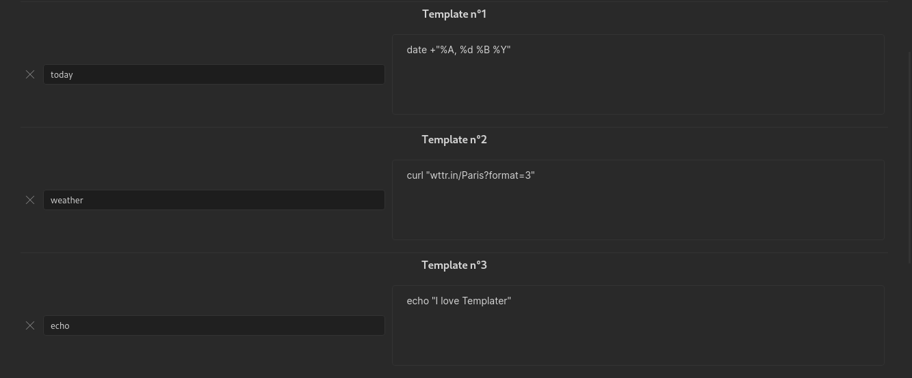

# 시스템 명령어 사용자 함수

이 유형의 사용자 함수를 사용하면 시스템 명령어를 실행하고 그 결과를 검색할 수 있습니다.

시스템 명령어 사용자 함수는 Templater의 설정에서 활성화해야 합니다.

## 시스템 명령어 사용자 함수 정의

새로운 시스템 명령어 사용자 함수를 정의하려면 **함수 이름**과 **시스템 명령어**를 정의해야 합니다.

이를 위해 플러그인 설정으로 이동하여 `사용자 함수 추가`를 클릭합니다.

이 작업을 완료하면 [Templater](https://github.com/SilentVoid13/Templater)는 정의한 대로 이름을 가진 사용자 함수를 생성하여 시스템 명령을 실행하고 그 결과를 반환합니다.

내부 함수와 마찬가지로, 사용자 함수는 `tp` JavaScript 객체 및 더 구체적으로 `tp.user` 객체 아래에서 사용할 수 있습니다.

## 인수 전달

사용자 함수에 선택적 인수를 전달할 수 있습니다. 이들은 속성과 해당 값이 포함된 단일 JavaScript 객체로 전달되어야 합니다: `{arg1: value1, arg2: value2, ...}`.

이러한 인수는 프로그램/스크립트에서 [환경 변수](https://en.wikipedia.org/wiki/Environment_variable) 형식으로 사용할 수 있습니다.

이전 예제에서는 다음과 같은 명령 선언이 됩니다: `<% tp.user.echo({a: "value 1", b: "value 2"})`.

시스템 명령어가 bash 스크립트를 호출하는 경우, `$a` 및 `$b`를 사용하여 변수 `a`와 `b`에 액세스할 수 있습니다.

## 시스템 명령어 내부 함수

시스템 명령어 내부에서 내부 함수를 사용할 수 있습니다. 내부 함수는 시스템 명령어가 실행되기 전에 대체됩니다.

예를 들어, 시스템 명령어 `cat <% tp.file.path() %>`을 구성한 경우, 시스템 명령이 실행되기 전에 `cat /path/to/file`로 대체됩니다.